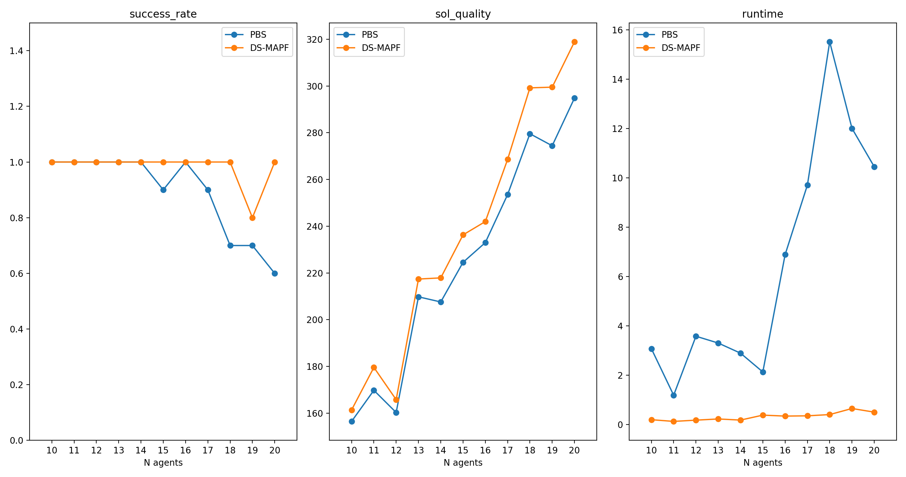

# MAPF Simulator (version 2)

## Algorithms
- PBS
- DS-MAPF

## Experiments

### lak108d Map

#### Specs:

- From 10 till 20 agents per run
- There are 10 runs with different start-goal positions per same _N_ of agents
- 1 minute max on each algorithm
- The time for DS-MAPF divided by _N_ of agents
- _A*_ limited to 3000 nodes
- The metric of quality is SoC
- Quality and runtime graphs are only of those cases who succeeded to solve an instance

## Credits

- [movingai.com | 2D Pathfinding Benchmarks](https://movingai.com/benchmarks/grids.html)
- [movingai.com | 2D Pathfinding Benchmarks - Warehouses](https://movingai.com/benchmarks/mapf/index.html)
- [np | np.where](https://numpy.org/doc/stable/reference/generated/numpy.where.html)
- [pytorch | READ_IMAGE](https://pytorch.org/vision/stable/generated/torchvision.io.read_image.html#torchvision.io.read_image)
- [github | A*](https://github.com/Arseni1919/A_star_Implementation)
- [github | PBS Original Implementation](https://github.com/Jiaoyang-Li/PBS)
- [geeksforgeeks | Ordered Dict](https://www.geeksforgeeks.org/ordereddict-in-python/)
- [matplotlib | Creating multiple subplots using plt.subplots](https://matplotlib.org/3.5.0/gallery/subplots_axes_and_figures/subplots_demo.html)
- [matplotlib | matplotlib.animation](https://matplotlib.org/stable/api/animation_api.html#id2)
- [matplotlib | matplotlib.pyplot.imshow](https://matplotlib.org/stable/api/_as_gen/matplotlib.pyplot.imshow.html)
- [geeksforgeeks | json.load](https://www.geeksforgeeks.org/json-load-in-python/?ref=lbp)
- [scipy | scipy.sparse.csgraph.floyd_warshall (from all to all dist)](https://docs.scipy.org/doc/scipy/reference/generated/scipy.sparse.csgraph.floyd_warshall.html)
- [sof | q](https://stackoverflow.com/questions/55109716/c-argument-looks-like-a-single-numeric-rgb-or-rgba-sequence)